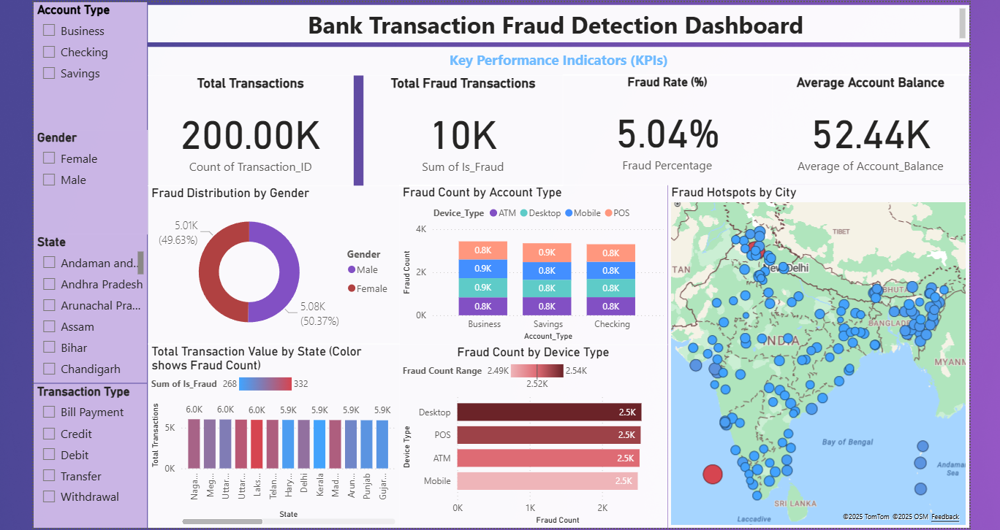

# 🏦 Bank Transaction Fraud Detection Dashboard (Power BI)

<p align="center">
  
</p>

---

### 👨‍💻 Author: [Vamsi Krishna Mulinti](https://www.linkedin.com/in/vamsi-krishna-mulinti)
**Role:** Data Analyst | BI Developer | Data Visualization Expert  
**Tools Used:** Power BI Desktop · DAX · Data Modeling · SQL · Geospatial Analytics · ETL  

---

## 📂 Download Power BI File
You can **view or download** the full Power BI dashboard (.pbix) file here 👇  
➡️ [Click to Download Fraud Detection Dashboard (.pbix)](https://drive.google.com/uc?export=download&id=1mHpL06hhe7NjQZLQauD9BqUMH827D--H)

---

## 📊 Project Overview
An interactive **Power BI dashboard** built to analyze fraudulent bank transactions by:
- Tracking transaction volumes and fraud counts.  
- Comparing fraud rates by **gender**, **account type**, and **device type**.  
- Visualizing **fraud hotspots geographically** using Power BI Maps.  
- Providing KPIs for **total transactions**, **fraud rate (%)**, and **average account balance**.

---

## 🚀 Key Insights
- 📈 **Fraud Rate:** 5.04% overall (derived using DAX measure).  
- 👩‍💼 **Gender Split:** Nearly equal fraud occurrence between males and females.  
- 💳 **Device Trends:** Desktop and POS show higher fraud counts compared to mobile.  
- 🌍 **Geospatial Insight:** Certain cities and states show fraud concentration clusters.  

---

## 🧠 DAX Measures Used
```DAX
Total Transactions = COUNTROWS('Bank_Transaction_Fraud_Detection')
Fraud Transactions = CALCULATE(COUNTROWS('Bank_Transaction_Fraud_Detection'), 'Bank_Transaction_Fraud_
