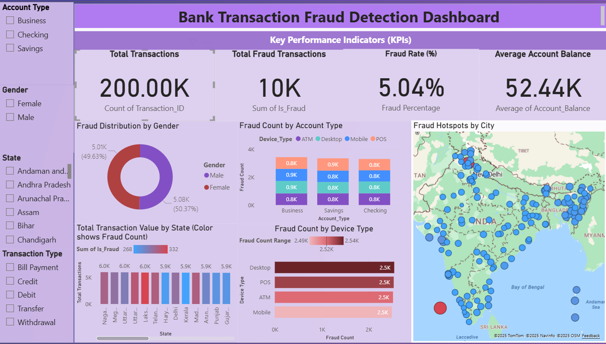

# 🏦 Bank Transaction Fraud Detection Dashboard (Power BI)

  

---

### 👤 Author: [Vamsi Krishna Mulinti](https://www.linkedin.com/in/vamsi-krishna-mulinti)
**Role:** Data Analyst | BI Developer | Data Visualization Expert  
**Tools Used:** Power BI Desktop · DAX · Data Modeling · SQL · Geospatial Analytics · ETL  

---

## 📂 Download Power BI File  
You can **view or download** the full Power BI dashboard (.pbix) file here 👇  
[Click to Download Fraud Detection Dashboard (.pbix)](https://drive.google.com/uc?export=download&id=1mHpL06hhe7NjJQZlQauD9bLUMH827D-H)

---

## 📊 Project Overview  
This project analyzes **bank transaction data** to identify and visualize potential **fraudulent activities**.  
The dashboard tracks critical KPIs such as:

- Total Transactions  
- Fraud Rate (%)  
- Fraud Count by Gender and Account Type  
- Fraud Hotspots by City (Geospatial view)  

It helps banking and compliance teams **detect anomalies**, **reduce financial risk**, and **strengthen fraud prevention models** through data-driven insights.

---

## 🚀 Key Features
- Dynamic filters by **Account Type**, **Gender**, and **State**
- KPI cards showing key fraud metrics
- Interactive donut and bar charts for segmentation
- Geospatial visualization of fraud hotspots using Power BI maps
- Clean, modern Power BI design with responsive layout

---

## 🧠 Insights Derived
- Highest fraud rate occurs in **mobile transactions**
- **Savings accounts** show slightly higher fraud risk than checking
- Fraud is concentrated in a few major cities (visualized in map)
- Gender distribution is almost balanced — indicating **systematic fraud patterns**

---

## 🧩 Tech Stack
**Power BI**, **DAX**, **SQL**, **Geospatial Analyti**
